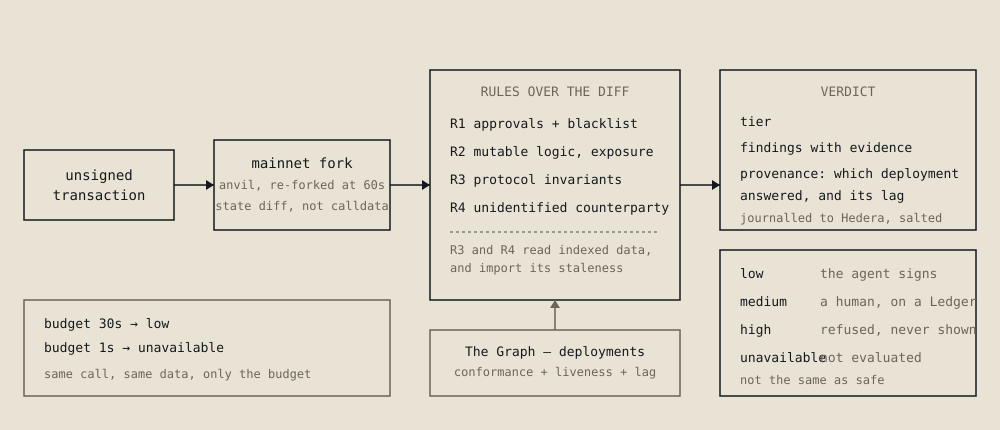

# presign

**Risk verdicts for agent wallets that declare how stale their evidence was.**

Live at **https://presign.dev** — three transactions on the page are judged by
that instance while you read it. `GET /quote` and `GET /health` need no key;
agents read [`/llms.txt`](https://presign.dev/llms.txt).

An autonomous agent holding a key signs whatever its planner hands it. `presign`
answers one question before that signature — *is this safe to sign?* — and
attaches the thing that makes the answer checkable: which data it rested on, and
how far behind chain head that data was.

The second half is the part nobody else returns.



### Judging this, by track

Each of these is one command or one URL, so none of it has to be taken on trust.

- **The Graph** — the operational layer is
  [`packages/operational-layer`](./packages/operational-layer) and ships on its
  own as [`packages/mcp-server`](./packages/mcp-server) with a `SKILL.md`.
  Conformance is measured by query and liveness against chain head, never
  declared. `npm run coverage` prints the 33 conforming deployments across 3
  schema families and 5 networks; [Layer 1](#layer-1--the-operational-layer-over-indexed-data)
  says what is layered on top of discovery, and [Prior art](#prior-art) says
  what this is answering.
- **Hedera** — the live service is x402-gated on Hedera testnet:
  `POST https://presign.dev/verdict/full` returns a real 402 with its manifest,
  and `GET /quote?to=<address>` prices a verdict *before* payment, metered by
  the indexed deployments the verdict will actually read. Every verdict is
  journalled to HCS topic
  [`0.0.10413192`](https://hashscan.io/testnet/topic/0.0.10413192) under a
  salted commitment. `npm run demo -- --paid` shows the inbound HBAR and the
  outbound USDC against one transaction; see
  [What a verdict costs](#what-a-verdict-costs).
- **Ledger** — [`packages/ledger`](./packages/ledger) holds the DMK escalation
  and the Key Ring secret source, both verified on a Nano X. `medium` goes to
  the device, `high` never reaches it, and the signing broker in
  [`packages/verdict-mcp`](./packages/verdict-mcp) lets a model ask for a
  signature it can never hold the key for — see
  [Letting a model sign](#letting-a-model-sign--only-through-a-verdict).
  Tooling feedback, written daily rather than assembled at the end, is
  [`docs/feedback/ledger.md`](./docs/feedback/ledger.md).

**In short:**

- An agent sends an **unsigned** transaction. It comes back with a tier, the
  findings, and the provenance — *which deployment answered and how far behind
  chain head it was*.
- `unavailable` is a tier, not an error: a rule that cannot get fresh data has
  no way to report "nothing found". **Same call to Aave, budget 30s → `low`;
  budget 1s → `unavailable`.** Try both on the landing page.
- Rules read the **state diff from a mainnet fork**, not the calldata, so an
  approval buried in a smart account's `execute` is still an approval.
- Built solo, to a specification written before the first commit:
  [`prompts/`](./prompts) holds it, and
  [`docs/AI_USAGE.md`](./docs/AI_USAGE.md) records what was decided by hand,
  what an AI tool typed, and the four decisions the test runs forced.

Everything below is the evidence for the claims above; each section names the
command that reproduces it.

## The claim, demonstrated

Same call to the Aave V3 pool. Same indexed data, same code path, same rules.
Only the freshness budget differs:

```
budget 30s  →  low          source: Aave V3 Ethereum (QmcXE5QVcBcv…), lag 12.3s
budget  1s  →  unavailable  R3 could not run: all_candidates_stale
```

A clean verdict is not merely unlikely without fresh context — it is
unreachable. `unavailable` is a separate outcome in the type system rather than
a softer way of saying `low`, so a rule that cannot obtain fresh data has no way
to report "nothing found". Both rows above come from `npm run demo`.

## Why this rather than an existing scanner

Pre-signature simulation is not new. Hexagate, Blockaid and GoPlus all do it, and
the agent-facing packaging — MCP servers, LangChain tools, pay-per-call x402
endpoints — is already shipped. **Acting before the signature is not a
differentiator, and this repo does not claim it as one.**

What none of them return is how fresh the evidence was. A green verdict computed
from a subgraph six hours behind chain head is indistinguishable from one
computed at chain head. On a dashboard that is a footnote. Immediately before a
signature it is the entire risk.

That problem is partly self-inflicted, and worth saying so. A fork at chain
head is as fresh as its RPC; a scanner that only simulates never has a lag to
report. The lag enters because presign also reads indexed protocol data: R3
checks a protocol's own accounting — borrows against deposits, locked value
against balances — which is aggregate state across a market that no RPC call
returns inside a second. Depending on subgraphs buys that check and imports
their staleness, and the verdict's job is to say how much it imported.

It imports their availability too. Fail-closed means an unreachable gateway
blocks the agent rather than waving it through, and a counterparty whose
subgraph cannot answer in time — the Uniswap V3 factory, on the runs where its
deployments fall behind — is blocked rather than guessed at. That is the trade,
taken deliberately: an agent that cannot get an answer should not act as though
it got a good one.

Three things follow, and each is load-bearing rather than decorative:

1. **Lag is in the response.** Every verdict names the deployments it was
   computed from and how many seconds behind head each one was — including when
   nothing was found, because "no problems" and "no problems according to a
   deployment four seconds behind head" are different claims and only the second
   can be checked.
2. **Fail-closed on stale context.** If the counterparty is a pool or market of a
   known protocol and fresh data for it is unavailable or past budget, the answer
   is `unavailable`, never `safe`.
3. **The data layer ships separately.** It is exposed as an MCP server with a
   `SKILL.md`, so another team can ask *"which deployments can answer this rule
   right now, within this lag budget?"* without adopting our rules, our
   simulation, or our opinions about risk.

## What the verdict tells the agent to do

```
low          the agent signs on its own
medium       escalate to on-device human confirmation (Ledger)
high         refuse
unavailable  refuse — the evidence was unobtainable, which is not the same as safe
```

Built for [ETHOnline 2026](https://ethglobal.com/events/ethonline2026), Start
Fresh (classic) track.

## Prior art

The Graph's [write-up of the ETHGlobal Lisbon 2026 winners](https://thegraph.com/blog/ethglobal-lisbon-2026-winners/)
describes several projects that reached pieces of this independently:
deeptrace rejects responses whose deployment ID does not match a pinned one;
EQLTY blocks a trade when freshness or block lag fails; BookerBob returns
"unavailable" rather than a confident wrong answer; atlas resolves a schema
family instead of a single subgraph and health-checks its sources before it
spends; Am I cooked matches approval spenders against a registry of documented
hacks.

The same write-up names what the four teams using standardized schemas each
built by hand: a registry mapping schemas to deployments, *"which signals both
that standards work and that the index of what conforms to them is missing."*
presign's operational layer is that index — conformance measured by query
rather than declared, liveness against an independent chain head, bound to
rules under a lag budget — and it ships on its own as an MCP server
([`packages/mcp-server`](./packages/mcp-server)) that any of those projects
could call instead of rebuilding it.

What presign adds on top is where freshness sits. In the projects above it is
a gate the answer has to pass; here it is part of the answer — every verdict
names the deployment and its lag — and `unavailable` is a tier of its own
rather than an error.

---

## Scope, stated plainly

`presign` is an **advisor, not a co-signer**. It never holds keys, never broadcasts,
and never stands in the path of funds. Co-signing would give stronger lock-in and
moves the project into custodial territory with the legal consequences that follow;
that is a deliberate trade, not an oversight.

## Architecture

```
agent -> [x402 / Hedera] -> gateway
                              |- decode unsigned calldata
                              |- fork simulation -> state diff
                              |- operational layer -> live deployments
                              |- rules R1-R4 over the diff
                              '- verdict + reasons + provenance
                                     |
                              every verdict journalled to HCS
                                     |
   low -> agent signs  ·  medium -> Ledger  ·  high, unavailable -> refuse
```

### Layer 1 — the operational layer over indexed data

Subgraph *discovery* is not rebuilt here; `subgraph-registry` already crawls the
Graph Network meta-subgraph and classifies thousands of subgraphs. Its reliability
score, however, is an economic one (query fees, curation, allocation) — it measures
*"popular and staked"*, not *"indexing right now"*. Four things are layered on top:

- **conformance by query** — introspection plus a probe request, recording which
  fields a deployment actually answers, not a schema hash;
- **liveness and freshness** — `_meta { block hasIndexingErrors }` against chain
  head, expressed as lag in seconds;
- **capability binding to rules** — the query is not "what is this subgraph" but
  "which deployments can answer R3 right now under an N-second lag budget";
- **warm-up** — candidates are resolved ahead of time and kept warm, which is
  what keeps every verdict after the first for a counterparty inside 200 ms;
  the first one still pays for discovery, and [Measured](#measured) says what
  it costs.

### Layer 2 — the verdict

Simulation does the load-bearing work: running the transaction against a fork
produces the real state diff, and rules read the diff rather than guessing from
calldata.

| Rule | What it catches |
|---|---|
| **R1** Approvals and flagged addresses | An allowance written in the state diff to a spender outside the allowlist that is at least 2^128, at least the token's total supply, or covers the owner's whole balance, and `setApprovalForAll` over a collection — including approvals nested inside a smart account's `execute`. Any approval to, call to or payment to an address on [ScamSniffer's open blacklist](https://github.com/scamsniffer/scam-database), fetched at startup and every six hours, is critical |
| **R2** Mutable logic | Contract behind a proxy with a live admin or no timelock. An implementation swap inside the transaction being judged raises the tier on its own; the standing admin finding raises it only when the transaction adds exposure to the contract — sends it value, moves tokens into it, grants an allowance on it, or raises a balance it records for the sender — read from the state diff; otherwise the same finding is `info` |
| **R3** Invariant breach | States no accounting can produce: a negative balance, borrows above deposits, value locked against a zero token balance, shares outstanding with no assets behind them — read from a deployment whose own `_meta`, in the same response as the data, is inside the freshness budget |
| **R4** Unidentified counterparty | No deployment in the registry indexes the contract, and code first appeared at the address N days ago; an age that could not be established is a warning, never an old contract |

R4 is the one rule whose finding is an *absence*. The other three look for
something specific and are honestly silent when they do not find it — which
means a call to a contract deployed this morning that nobody has ever indexed
used to come back `low`, three rules having each found nothing. That is the
same fail-open the `unavailable` tier exists to prevent, arriving by a
different route, and it silently passed the exact case this project is for.

The claim R4 makes is narrow enough to check: not "this contract is unknown",
which is unfalsifiable, but "no deployment in *this* registry indexes *this*
address", which anyone can query. With no verified ABI there is only a 4-byte
selector, and a familiar one proves nothing — matching `approve(address,uint256)`
costs an attacker nothing and is what makes a malicious clone look ordinary.

Age is searched for, not looked up: no RPC returns a contract's birthday, so
one `eth_getCode` at a seven-day horizon answers the question for almost every
counterparty, and a bisection inside that window recovers the exact deployment
block when it matters. R4 also reads EIP-7702 delegations and judges the
delegate rather than the account — without that, every smart account would be
reported as an unidentified contract, and agent wallets are exactly the
accounts that carry delegations.

## Status

This section tracks what is actually running, not what is planned.

| Component | State |
|---|---|
| Repository scaffold | done |
| Secret resolution with declared provenance | done |
| Registry discovery adapter | done |
| Liveness probe (`_meta` vs chain head) | done — verified against live mainnet |
| Conformance probe (introspection + probe query) | done — verified against live mainnet |
| Capability binding + warm cache | done — verified against live mainnet |
| MCP server + `SKILL.md` | done — 7 tools, verified over stdio |
| Fork simulation + rules R1-R3 | done — verified against live mainnet fork |
| R4 unidentified counterparty + EIP-7702 delegation | done — verified against live mainnet |
| Proxy upgrade history over MCP | done — verified against a live stream |
| Ledger DMK escalation, Key Ring source | done — both verified on a Nano X |
| x402 inbound (Hedera) + HCS journal | done — real paid request on testnet, settled through Blocky402 |
| Chain guard | done — a transaction for a chain the fork does not hold is refused before payment |
| Incident registry for R1 | done — ScamSniffer's open blacklist, loaded live and shown on `/health` |
| R3 pool resolution through the factory | done — Uniswap V3 pools and V2 pairs verified against live mainnet |
| Key broker on `wallet-cli ring` | done — verified on a Nano X: the verdict MCP paid for a real verdict with a key decrypted from the Key Ring, with no key in any file or environment variable |
| x402 outbound (The Graph on Base) | done — real paid queries settled on Base, verified on-chain |
| Metered pricing | done — live: `/quote?to=` prices a full verdict by the deployments it will check |
| Salted journal commitments | done — the public entry cannot be matched to a transaction without the caller's salt |
| Fork age and list age in provenance | done — every verdict states how old its simulated block and its blacklist were |
| R2 escalates only on added exposure | done — verified against live mainnet: a USDC transfer is `low`, an approval `medium` |
| Signing broker (`sign_transaction`) | done — verified end to end on a Nano X with the agent key sealed in the Key Ring: `low` signed without the device, `medium` clear-signed on it and countersigned by the agent key, `high` refused without the device ever being asked. Journal entries 42–44 on topic `0.0.10413192` |
| Transaction effects in every verdict | done — verified against live mainnet: a USDC or ETH transfer names the amount and the recipient |
| Registry subprocess | done — one shared client, survives a missing binary, a crash and a stuck handshake, restarts, and sees none of the service's credentials |

### Measured

Component timings against live mainnet: liveness 173 ms, conformance 394 ms,
warming R3 across six lending candidates 611 ms, cached resolve
sub-millisecond. Those are parts, and the sum of parts is not a latency claim,
so `npm run latency` times whole verdicts instead:

| counterparty | cold | warm p50 | what it pays for |
|---|---|---|---|
| Aave V3 Pool | 3037 ms | 83 ms | R3 discovers, probes and queries |
| USDC | 410 ms | 16 ms | R1, R2, and a counterparty R3 cannot speak for |
| Uniswap V3 Factory | 550 ms | 161 ms | the slow end: a DEX subgraph answering in seconds |
| freshly deployed contract | 720 ms | 6 ms | R4 bisects historical `eth_getCode` |

Cold is the first verdict for that counterparty; warm is the repeats after it,
and warm is what an operator sees for every request but the first. Warm stays
inside 200 ms across the set and has been stable all week.

Cold has not been. It pays for discovery and for probing candidate deployments
against a shared gateway, so it moves with that gateway: three consecutive runs
on 12 September 2026 measured the Aave case at 2775, 4090 and 3037 ms, and the
factory at 2058, 643 and 550 ms. The plan's one-second budget holds warm
everywhere; for a first verdict against an indexed protocol it does not, and
the table above is one run rather than a best-of.

The gateway timeout stays at three seconds. Raising it to eight, to
accommodate the factory, cost a cold USDC verdict 306 ms → 7.7 s, because a
slow deployment indexing USDC then spends most of the budget before R3 gives up
on it — and USDC is on the path of almost every agent transaction while the
factory is not. The short limit wins and the trade-off is a caller-settable
`timeoutMs`, because it is a latency preference and not a safety one. What
eventually made the factory answerable was not more time: probes issued
together contended for that gateway and a failed probe was cached, so one
contended timeout stood for the whole deployment. Failures are now re-asked one
at a time and never cached, and the factory has answered since.

### False positives

A scanner that marks ordinary contracts as dangerous is worse than one with
narrow coverage — the first thing anyone does with a verdict they distrust is
ignore it. `npm run safety` runs the rules over twelve mainnet contracts
nobody disputes:

```
low: 12
```

Each contract is called with a view function it answers — `totalSupply()`,
`getReservesList()`, `owner()` — not with empty calldata. Empty calldata
reverts on most of them, and a transaction that reverts in simulation is now
`unavailable` rather than `low`: the rules that read what it changes had
nothing to read, and a contract that reverts on the fork but succeeds on chain
is exactly how code hides from simulation. A network error on that call is no
longer read as a revert either; it fails the verdict.

None reaches `high`, and none reaches `medium`. USDC used to be the one
`medium`: its proxy admin is a plain EOA, so every call to it asked for a human.
That was right about USDC and wrong about the call — it would have made every
stablecoin payment an agent sends wait for somebody. R2 now raises the tier only
when a transaction adds exposure to the upgradeable contract: sends it value,
moves tokens into it, grants an allowance on it, or raises a balance it records
for the sender, each proven from the state diff the way R1 proves an allowance.
A USDC transfer out of the wallet is `low`, with the admin finding kept at
`info`. An approval on USDC is still `medium`. A deposit into an upgradeable
vault pulled in by `transferFrom` — no approval and no ETH in the transaction
itself — still counts, because that is the rug R2 exists for.

Twelve of twelve on 12 September 2026. The row that used to move is the Uniswap
V3 factory: its deployments are the slowest of the set, and on earlier runs it
came back `unavailable`, as Curve's 3pool did once. That looked like the
indexer's lag and fail-closed doing exactly what it says. Most of it was ours:
probes issued together contended for one gateway and a failed probe was cached
for ten seconds, so a single contended timeout stood for the deployment and for
every verdict in that window. Failed probes are now re-asked one at a time and
never cached, and both rows have been `low` since. Real lag can still push a row
to `unavailable` — that is the cost of fail-closed, and it is why the count here
is a command rather than a claim.

Running this is what found the one real false positive there was: R4 charged a human confirmation for
Permit2, Multicall3 and Uniswap's router, on the reasoning that a contract old
enough to be known and still unindexed was a coverage gap. That reasoning was
wrong. Indexing tracks whether a contract emits events worth querying, not
whether it can be trusted, so immutable utility contracts are systematically
unindexed. The finding is still reported; it no longer moves the tier.

### Coverage

`npm run coverage` sweeps every schema family the rules read against every
network the engine maps:

| schema family | mainnet | optimism | matic | base | arbitrum |
|---|---|---|---|---|---|
| lending-cdp | 6 | 3 | 3 | 3 | 7 |
| dex-amm | 2 | 2 | 1 | 1 | 2 |
| yield-vault | 2 | 0 | 0 | 0 | 1 |

**33 conforming deployments across 3 schema families and 5 networks** — Aave
V2/V3, Compound V3, Morpho Blue, DForce, Sonne, Radiant, Moonwell, Curve,
Uniswap V3, Velodrome V2, Sushiswap, Yearn V2, Rari among them — reachable by
the same rules with no per-protocol code.

Those figures were taken on **12 September 2026**, and the command will print
today's rather than these. The conforming set moves with the health of the
index: a deployment that is behind head, erroring or briefly unreachable is not
counted, so both the total and the names drift by a few from run to run. That
is the measurement working — a number that never moved would mean it was
written down once rather than measured. Nothing has to be added for a new protocol
inside a family that is already read; it is covered the moment somebody
indexes it with the standard schema. What costs a line is a new family, and
the three rows above are what those three lines bought.

Pools needed one more step. DEX subgraphs index pools through templates, so a
manifest names the factory and never the pool, and asking the registry which
deployments index a pool's address finds almost nothing. For the Uniswap V3
USDC/WETH pool it found two deployments that do not speak the schema and one
whose only indexer was down, and R3 answered `unavailable` — correctly, since a
conforming deployment might have been behind the failure, and one was. R3 now
asks the pool for its `factory()`, has the factory confirm the pool through
`getPool` or `getPair` at the pool's own tokens, and reads that one pool by id
from the deployments indexing the factory. The confirmation is what keeps an
impostor from borrowing Uniswap's standing by returning its factory address.
The same code serves Uniswap V2 pairs.

### What `npm run demo` prints

Five scenarios against a live mainnet fork. The middle pair is the one from
the top of this README, shown here in context:

| Scenario | Verdict |
|---|---|
| Unlimited USDC approval to an address on ScamSniffer's blacklist | `high` — do not sign |
| Bounded approval to Permit2 on the same upgradeable token | `medium` — confirm on device |
| Call to Aave V3 Pool, healthy, fresh data | `low` — source named, 12.3 s lag |
| Same call, 1-second freshness budget | `unavailable` — do not sign |
| Contract deployed minutes ago, indexed by nobody | `high` — do not sign |

The last row uses no fixed address. The demo walks back from the fork block
until it finds a real contract created minutes earlier, because any address
written down here would be a week old by the next run. R1, R2 and R3 are all
silent on it, and before R4 existed those three silences added up to `low`.

The first row never reaches the device: a transaction already judged dangerous
is refused rather than shown to a human, because a prompt is a request and
people approve prompts. `npm run demo -- --device` runs the second row against a
real Ledger.

## What a verdict costs

### Priced by the data it reads

A full verdict is not a flat fee. It costs 0.001 HBAR for simulation, R1, R2
and R4, plus 0.001 HBAR for each indexed deployment R3 will check for that
counterparty, capped at eight. The count is taken before the 402, with the same
selection the rule then spends queries on, against the registry and the fork —
never the metered gateway. Quoted by the live service:

| counterparty | deployments | full verdict |
|---|---|---|
| USDC | 1 | 0.002 HBAR |
| Aave V3 Pool | 2 | 0.003 HBAR |
| Uniswap V3 USDC/WETH pool | 6, three through its factory | 0.007 HBAR |

`GET /quote?to=<address>` returns the count and the breakdown before anything
is paid, and the verdict response carries the same breakdown under
`cost.pricing`. A Hedera `exact` payment is a transfer signed for a fixed
amount, so it cannot be trimmed after the verdict runs, and the x402 SDK offers
no `upto` scheme for Hedera; counting first is the metering available. The
price is held for five minutes, so the 402 and the paid retry agree.

Eight is also the most deployments R3 will probe, so it never spends queries on
one it did not charge for. When a counterparty has more candidates and none of
the first eight speaks the schema, the answer is `unavailable` rather than
"nothing to check": a ceiling must not become a clean verdict. Counting is free
before payment, so new counterparties priced per client are rate-limited;
prices already held are not.

### Both sides of one transaction

The service charges for a verdict and the verdict costs something to produce.
`npm run demo -- --paid` shows both against one transaction, in one process,
with nothing mocked:

```
  IN  — the agent paid us, on Hedera
        0.005 HBAR   0.0.10399265 -> 0.0.10398276
        0.0.9185802@1788837451.614028743

  OUT — we paid The Graph, on Base
        0.01 USDC  QmcXE5QVcBcv…  0xf1928bbe4cf4d666a31c4e9f6a2bf3704c77ec9bd717b43a7fe3e79dd99f2e5d
        1 queries, 0.01 USDC in total
```

That block, and the response body further down, are from before the service was
metered, which is why both charge a flat 0.005 HBAR; `GET /quote` prices a
verdict today and the shape of the response is unchanged. The run settled
through x402.org's facilitator, which is the `0.0.9185802` fee payer above. The
service has since moved to Blocky402's testnet facilitator; a settlement from
it, checkable on the mirror node, is
`0.0.7162784@1789089549.242890259` — 0.001 HBAR from the agent to the service,
the network fee paid by Blocky402's account.

Split across two terminals those are two anecdotes. Printed together against
one transaction they are a margin, and both settlements are public: the HBAR
on Hedera testnet, the USDC on Base. The verdict is journalled to HCS in the
same run, carrying a commitment to the transaction, the tier, and the
deployment that answered with its lag — and no calldata, address or value. The
deployment and the timestamp still say which protocol was asked about and when;
see [Known limits](#known-limits).

The commitment is SHA-256 over a random salt and the transaction's canonical
fields, and the salt goes back to the caller in the response (`journal.salt`)
and nowhere else. An unsalted hash — which is what the journal carried first —
is a lookup table rather than a secret: an agent's address is public, and an
approval to Permit2 has exactly one calldata, so anyone could hash guesses and
learn which agent asked about what. With the salt, only someone holding it and
the transaction can match an entry to it.

Both halves are in the response body too:

```json
"cost": {
  "charged": "0.005 HBAR",
  "paid_upstream": {
    "funding": "x402",
    "queries_paid": 2,
    "total": "0.02 USDC",
    "payments": [{ "deployment_id": "Qm…", "amount": "0.01 USDC", "transaction": "0x…" }]
  }
}
```

Queries to The Graph can be funded two ways. A Studio API key draws on a
monthly plan: the per-query cost is real but arrives as a bill, and nothing in
the response says what it was — so on that path `paid_upstream` reports
`known: false` rather than a zero it would be inventing. The x402 path pays
$0.01 USDC per query on Base, and the amount is read from the gateway's own
402 manifest, recorded only once settlement returns, with the settlement hash
attached.

The transfer is EIP-3009 `transferWithAuthorization`, so a payment is a
signature the facilitator submits. The wallet needs USDC and no ETH, and this
process never broadcasts a transaction — which is the same claim the advisor
makes about signing.

A Studio key wins whenever one exists, because spending real money should be
deliberate; `GATEWAY_FUNDING=x402` forces payment. The case worth pointing at
is the third one: **no key and a funded wallet**, where the process pays its
own way. That is not a fallback but the reason x402 exists, in The Graph's own
words — *you have a funded wallet and no API key, and no human to mint one*.

Payments are sent **one at a time**. The gateway refuses concurrent payments
from the same payer — four in flight returned two answers and two bare 402s —
and the rule that needs indexed data probes every candidate deployment in
parallel, because that is free when a key funds the queries. Without
serialising, the paid path lost a probe or two per verdict at random and
fail-closed logic correctly refused to answer, with a funded wallet and
correct code. A verdict a second slower is still a verdict; one assembled
from whichever probes won a race is not.

**Verified with real money.** `npm run demo` on the paid path returns `low`
for the Aave call with its deployment and lag named, and `unavailable` for the
same call at a 1-second budget — the project's central claim, produced
entirely from data bought a cent at a time. A settlement picked from that run
resolves on Base: 0.01 USDC from the payer to the `payTo` in the gateway's own
manifest, gas paid by the facilitator rather than by us.

### Known limits

These are the ways a `low` can still be wrong, written down because a verdict
whose blind spots go unstated invites more trust than it has earned.

- **R4 counts any manifest.** A counterparty is identified once any deployment
  in the registry names it, whatever that deployment's age, signal or health,
  and the contract's age is then not checked. Deploying a drainer and
  publishing a trivial subgraph that names it silences R4 once the registry
  picks the subgraph up.
- **R2 trusts a delay getter.** An admin contract counts as a timelock when
  `getMinDelay()` or `delay()` returns a non-zero value, and a catch-all
  fallback can return one. UUPS and beacon proxies, whose admin slot is empty,
  are reported at `info` and never raise the tier; diamond proxies are not
  detected.
- **R3 samples a protocol it matched directly.** When a deployment indexes the
  counterparty by its own address, R3 checks the protocol's ten largest markets
  rather than the market the transaction touches. Only pools resolved through
  their factory are checked by id, so a breach in a small market can sit
  outside the sample.
- **R1 sees Solidity's nested mapping.** Allowances kept in another layout —
  Permit2's triple mapping, packed slots — are not proven, and neither is a
  spender packed into calldata without ABI padding and touched nowhere in
  state.
- **The journal shows the shape of a decision.** The salt hides the
  transaction, but an entry still names the deployment that answered, which
  says what protocol the counterparty belongs to, and its consensus timestamp
  lands seconds before the agent broadcasts. Matching the two by time and
  protocol is realistic for anyone watching the mempool.
- **Dependencies carry advisories.** `npm audit --omit=dev` reports 32
  vulnerabilities, one critical, all in transitive dependencies of the Ledger
  DMK and the Hedera SDK: `protobufjs`, `@grpc/grpc-js`, `undici`, `ws` and the
  React Native tree the Hedera SDK pulls in through its cryptography package.
  Exploitability here is unconfirmed — the protobuf schemas are local, though
  gRPC and undici do sit on network paths. Pinning them through npm `overrides`
  was tried and does not take effect on this graph: npm records the override
  and resolves the same versions. The alternative is regenerating the lockfile
  or forcing major bumps of the SDKs, which is not a change to make without
  running the device and the stream against it afterwards.

## Repository layout

```
packages/operational-layer   freshness, conformance, capability binding
packages/verdict-engine      simulation, rules R1-R4, tiered verdict
packages/gateway             composes verdict, escalation and confirmation
packages/ledger              on-device confirmation, Key Ring secret source
packages/hedera              verdict journal on the Consensus Service
packages/service             x402-gated verdict service
packages/payer               pays for verdicts over x402, key checks, session budget
packages/verdict-mcp         lets a model buy a verdict as an MCP tool
packages/agent               an agent that buys a verdict before signing
packages/demo                runnable end-to-end demonstration
packages/mcp-server          MCP surface + SKILL.md for other agents
packages/substreams          proxy upgrade history, streamed from Substreams
packages/secrets             credential resolution with declared provenance
docs/feedback/               per-partner tooling feedback, written as we go
docs/setup/                  device and environment runbooks
docs/AI_USAGE.md             what was decided by hand, what an AI tool typed
prompts/                     the specification each phase was built from
```

### Running it

```bash
npm install
npm run demo              # five scenarios against a live mainnet fork
npm run demo -- --device  # medium tier escalates to a real Ledger
npm run demo -- --paid    # real money both ways, one transaction, two chains
```

Every number claimed above is a command, not a screenshot:

```bash
npm run latency           # whole verdicts timed, cold and warm apart
npm run safety            # the rules over twelve undisputed mainnet contracts
npm run coverage          # conforming deployments per schema family per network
```

`npm run safety` exits non-zero if anything reaches `high`, so it can gate a
release rather than be read and shrugged at.

Needs a Subgraph Studio API key at
`~/.presign/secrets/the-graph__studio-api-key` (mode `0600`), or
`THE_GRAPH_STUDIO_API_KEY` in the environment, plus Foundry for the fork, and
an archive-capable Ethereum RPC at `~/.presign/secrets/ethereum__rpc-url` (or
`ETH_RPC_URL`). Archive access is not optional: R4 dates a contract with
historical `eth_getCode`, and the fork reads state at a pinned block. A public
endpoint that refuses archive reads is detected at startup and said so.

To pay per query instead, put a Base private key at
`~/.presign/secrets/base__payer-key` (mode `0600`) or `BASE_PAYER_KEY`, and
fund that address with USDC on Base. No ETH is needed: payments are EIP-3009
authorisations, submitted by the facilitator. With a payer key and no Studio
key, the process pays automatically.

### Letting a model buy the verdict

Any agent that speaks HTTP and x402 can already buy a verdict. A model in an
MCP client cannot: it has tools, not a payment client, so somebody had to write
the x402 exchange before it could ask. `@presign/verdict-mcp` is that exchange,
packaged as a tool.

The paying key belongs in the Ledger Key Ring, not in the MCP config. Seal it
once with `wallet-cli ring encrypt` as `~/.presign/ring/hedera__testnet-agent-key.enc`
(the exact commands are in [`packages/verdict-mcp/README.md`](./packages/verdict-mcp/README.md)),
then register the server so the ring password is read from the OS keychain at
launch:

```bash
claude mcp add presign-verdict \
  -e HEDERA_TESTNET_AGENT_ID=0.0.XXXXXXX \
  -- sh -c 'WALLET_PASS=$(secret-tool lookup service ledger-wallet-cli account default) \
            exec node "'"$PWD"'/packages/verdict-mcp/dist/bin.js"'
```

Without a Ledger, `-e HEDERA_TESTNET_AGENT_KEY=…` or a file under
`~/.presign/secrets` works too, and the server says on start which of the three
the key came from.

`get_quote` and `check_service` are free; `get_verdict` pays over x402 on Hedera
and returns the tier with `what_to_do` attached. The model spends from a session
budget it cannot raise, checked against the price in the 402 manifest **before**
anything is signed — a paid tool invoked in a loop otherwise empties a wallet a
cent at a time. Verified against the live service: a model bought a verdict over
stdio for 0.005 HBAR, settled on Hedera, and a 0.004 HBAR budget refused the
next one with nothing paid. Both figures are from the flat-price run that
verified this; the service is metered now, so the same two verdicts would cost
what `/quote` says for their counterparties — the budget check is against the
price in the 402 manifest, whatever that price is.

It is kept separate from the data-layer server below on purpose: that one is
built to be used without presign's rules, and paid verdicts inside it would
dissolve exactly that separation.

### Letting a model sign — only through a verdict

An advisor leaves an obvious gap: an agent that has been compromised or talked
into something simply does not ask. The verdict server closes it on the agent's
side. Give it an Ethereum key, sealed as `~/.presign/ring/ethereum__agent-key.enc`,
and it offers `sign_transaction`. The model asks for a signature and never
holds the key.

A verdict alone is not enough to sign on, and an early version of this broker
proved it: the rules look for known risks, and a plain transfer of the whole
balance to an attacker trips none of them — it came back `low` and would have
been signed. So every verdict now carries `effects`, what the simulated
transaction moves out of the wallet — ETH and tokens, and to whom, proven from
the state diff — and the broker applies its own policy before the tier decides:

| condition | what `sign_transaction` does |
|---|---|
| value to a recipient outside `PRESIGN_BROKER_ALLOW`, or ETH above the per-transaction ceiling, or effects the simulation could not read | treats the verdict as at least `medium` |
| ETH past the session ceiling, or a fee past its ceiling | refuses |
| `low` | signs with the agent key |
| `medium` | the Ledger signs the same call while the human reads it decoded; the broker recovers that signature, requires the device's own address, then signs with the agent key |
| `high`, `unavailable` | refuses, and the device is never asked |

The model supplies `to`, `value`, `data` and `chainId`, nothing else. The
sender is the broker's own account; nonce, gas and fees come from the chain
and are held to ceilings, because a model that could set the fee could hand the
balance to a block builder, and one that could set the nonce could collect
signatures to broadcast after the world had changed. The verdict must be about
this transaction: the broker recomputes the journal commitment from the
response's salt and refuses on a mismatch, and it refuses a service URL that is
not `https`.

A blind-signed hash is not an approval, and neither is a signature over
different bytes or from another key. The device approves with a nonce no
account reaches, so its signature — a real transaction from the Ledger account
for the same call — can never be included in a block; only a commitment to it
is returned. Nothing is broadcast.

The service is still an advisor and still holds no key. The key and the policy
that gates it live with whoever runs the agent, which is where a key belongs.

```bash
# generate a key that never exists in plaintext, straight into the ring
node -e 'process.stdout.write(require("crypto").randomBytes(32).toString("hex"))' | \
  wallet-cli ring encrypt --key presign:ethereum:agent-key -o ~/.presign/ring/ethereum__agent-key.enc

# PRESIGN_LEDGER=1 attaches the device for medium verdicts
PRESIGN_LEDGER=1 node packages/verdict-mcp/dist/bin.js
```

Neither MCP server is published to npm; both commands assume a clone with
`npm install && npm run build` done, run from the repository root.

### Using the data layer without the rest

The operational layer ships as an MCP server so another team can consume
freshness-gated data selection without adopting our rules, our simulation, or
our opinions about what is risky:

```bash
claude mcp add presign -- node "$PWD/packages/mcp-server/dist/bin.js"
```

See [`packages/mcp-server/SKILL.md`](./packages/mcp-server/SKILL.md).

## Development

Requires Node 22 (`.nvmrc`) and Foundry for the simulation layer.

```bash
npm install
npm run build
npm test
```

## License

MIT — see [LICENSE](./LICENSE).
